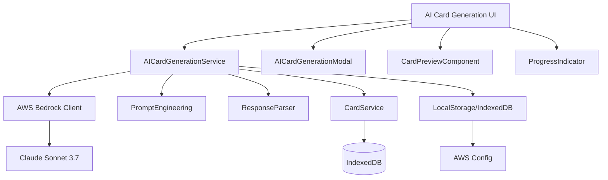
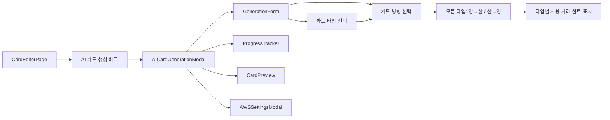
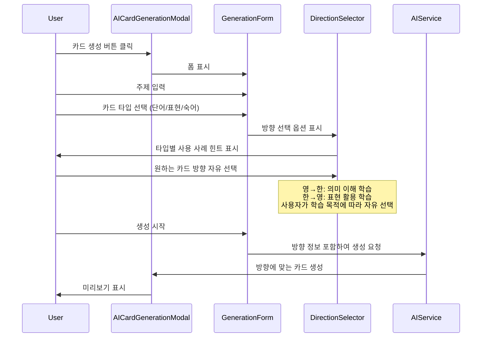

# Design Document

## Overview

AI 카드 생성 기능은 Amazon Bedrock의 Claude Sonnet 3.7 모델을 활용하여 사용자가 지정한 주제에 대한 영어 학습 플래시카드를 자동으로 생성하는 기능입니다. 이 기능은 기존 MyAnki 애플리케이션의 아키텍처와 완전히 통합되며, 클라이언트 측에서 AWS SDK를 사용하여 Bedrock 서비스와 직접 통신합니다.

## Architecture

### High-Level Architecture



### Component Architecture



### UI Flow with Card Direction Selection



## Components and Interfaces

### 1. Core Service Layer

#### AICardGenerationService
```typescript
interface AICardGenerationService {
  // AWS 인증 관리
  setAWSCredentials(credentials: AWSCredentials): Promise<boolean>;
  testConnection(): Promise<boolean>;
  
  // 카드 생성
  generateCards(request: CardGenerationRequest): Promise<GeneratedCard[]>;
  
  // 생성 기록 관리
  saveGenerationHistory(history: GenerationHistory): Promise<void>;
  getGenerationHistory(): Promise<GenerationHistory[]>;
}

interface AWSCredentials {
  accessKeyId: string;
  secretAccessKey: string;
  region: string;
}

interface CardGenerationRequest {
  topic: string;
  cardCount: number;
  cardType: 'vocabulary' | 'expressions' | 'idioms' | 'mixed';
  difficulty: 'beginner' | 'intermediate' | 'advanced';
  language: 'ko' | 'en'; // 주제 입력 언어
  cardDirection: CardDirection; // 카드 방향 설정
}

interface CardDirection {
  front: 'english' | 'korean';
  back: 'english' | 'korean';
  description: string; // 사용자에게 보여줄 설명
}

// 미리 정의된 카드 방향 옵션
const CARD_DIRECTION_OPTIONS: CardDirection[] = [
  {
    front: 'english',
    back: 'korean',
    description: '영어 → 한국어 (단어 암기에 적합)'
  },
  {
    front: 'korean',
    back: 'english',
    description: '한국어 → 영어 (영작 연습에 적합)'
  }
];

interface GeneratedCard {
  id: string;
  front: string;
  back: string;
  cardType: string;
  difficulty: string;
  metadata: {
    topic: string;
    generatedAt: Date;
    confidence: number;
  };
}
```

#### BedrockClient
```typescript
interface BedrockClient {
  initialize(credentials: AWSCredentials): void;
  invokeModel(prompt: string, modelId: string): Promise<BedrockResponse>;
  testConnection(): Promise<boolean>;
}

interface BedrockResponse {
  content: string;
  usage: {
    inputTokens: number;
    outputTokens: number;
  };
  metadata: {
    modelId: string;
    timestamp: Date;
  };
}
```

### 2. Prompt Engineering Layer

#### PromptBuilder
```typescript
interface PromptBuilder {
  buildPrompt(request: CardGenerationRequest): string;
  validateResponse(response: string): boolean;
  parseResponse(response: string): GeneratedCard[];
  getPromptTemplate(cardType: string, direction: CardDirection): string;
}

// 카드 방향별 프롬프트 템플릿
const PROMPT_TEMPLATES = {
  vocabulary: {
    'english-korean': `
You are an English language learning expert. Generate {count} vocabulary flashcards for the topic "{topic}" at {difficulty} level.

Requirements:
- Front: English word only
- Back: Korean meaning, pronunciation (IPA), example sentence with Korean translation
- Format: JSON array with front/back fields
- Difficulty: {difficulty} level vocabulary
- No duplicates or inappropriate content

Response format:
[
  {
    "front": "apple",
    "back": "사과\\n발음: /ˈæpəl/\\n예문: I eat an apple every day.\\n번역: 나는 매일 사과를 먹는다."
  }
]
`,
    'korean-english': `
You are an English language learning expert. Generate {count} vocabulary flashcards for the topic "{topic}" at {difficulty} level.

Requirements:
- Front: Korean word/meaning only
- Back: English word, pronunciation (IPA), example sentence with Korean translation
- Format: JSON array with front/back fields
- Difficulty: {difficulty} level vocabulary
- No duplicates or inappropriate content

Response format:
[
  {
    "front": "사과",
    "back": "apple\\n발음: /ˈæpəl/\\n예문: I eat an apple every day.\\n번역: 나는 매일 사과를 먹는다."
  }
]
`
  },
  expressions: {
    'english-korean': `
Generate {count} English expressions for "{topic}" at {difficulty} level.
- Front: English expression
- Back: Korean meaning, usage context, example with translation
`,
    'korean-english': `
Generate {count} English expressions for "{topic}" at {difficulty} level.
- Front: Korean situation/context description
- Back: English expression, pronunciation, example with translation
`
  },
  idioms: {
    'english-korean': `
Generate {count} English idioms related to "{topic}" at {difficulty} level.
- Front: English idiom
- Back: Korean meaning, origin/etymology, example with translation
`,
    'korean-english': `
Generate {count} English idioms related to "{topic}" at {difficulty} level.
- Front: Korean meaning/situation
- Back: English idiom, origin, example with translation
`
  }
};
```

### 3. UI Components

#### AICardGenerationModal
```typescript
interface AICardGenerationModalProps {
  deckId: number;
  isOpen: boolean;
  onClose: () => void;
  onCardsGenerated: (cards: Card[]) => void;
}

interface AICardGenerationModalState {
  step: 'form' | 'generating' | 'preview' | 'settings';
  formData: CardGenerationRequest;
  generatedCards: GeneratedCard[];
  selectedCards: Set<string>;
  progress: GenerationProgress;
  error: string | null;
}

// 카드 방향 선택 컴포넌트
interface CardDirectionSelectorProps {
  cardType: string;
  selectedDirection: CardDirection;
  onDirectionChange: (direction: CardDirection) => void;
  showUseCaseHints?: boolean; // 사용 사례 힌트 표시 여부
}

// 방향 선택 UI 컴포넌트
const CardDirectionSelector = ({ cardType, selectedDirection, onDirectionChange, showUseCaseHints = true }: CardDirectionSelectorProps) => {
  return (
    <div className="card-direction-selector">
      <label className="block text-sm font-medium mb-2">카드 방향</label>
      <div className="space-y-2">
        {CARD_DIRECTION_OPTIONS.map((option) => (
          <div key={`${option.front}-${option.back}`} className="flex items-start space-x-3">
            <input
              type="radio"
              name="cardDirection"
              value={`${option.front}-${option.back}`}
              checked={selectedDirection.front === option.front && selectedDirection.back === option.back}
              onChange={() => onDirectionChange(option)}
              className="mt-1"
            />
            <div className="flex-1">
              <div className="font-medium">{option.description}</div>
              {showUseCaseHints && (
                <div className="text-sm text-gray-600 mt-1">
                  {DIRECTION_USE_CASES[cardType]?.[`${option.front}-${option.back}`] || option.useCase}
                </div>
              )}
            </div>
          </div>
        ))}
      </div>
    </div>
  );
};

// 모든 카드 타입에서 사용 가능한 방향 옵션
const CARD_DIRECTION_OPTIONS: CardDirectionOption[] = [
  {
    front: 'english',
    back: 'korean',
    description: '영어 → 한국어',
    useCase: '단어/표현 암기, 의미 이해에 적합'
  },
  {
    front: 'korean',
    back: 'english',
    description: '한국어 → 영어',
    useCase: '영작 연습, 표현 활용에 적합'
  }
];

// 카드 타입별 방향 설명 (참고용, 강제하지 않음)
const DIRECTION_USE_CASES = {
  vocabulary: {
    'english-korean': '영어 단어를 보고 한국어 뜻을 떠올리는 학습',
    'korean-english': '한국어 뜻을 보고 영어 단어를 떠올리는 학습'
  },
  expressions: {
    'english-korean': '영어 표현을 보고 의미와 사용법을 이해하는 학습',
    'korean-english': '상황이나 의미를 보고 적절한 영어 표현을 떠올리는 학습'
  },
  idioms: {
    'english-korean': '영어 숙어를 보고 의미와 유래를 이해하는 학습',
    'korean-english': '상황이나 의미를 보고 적절한 영어 숙어를 떠올리는 학습'
  },
  mixed: {
    'english-korean': '다양한 영어 콘텐츠를 보고 한국어로 이해하는 학습',
    'korean-english': '다양한 상황을 보고 적절한 영어 표현을 떠올리는 학습'
  }
};
```

#### AWSSettingsModal
```typescript
interface AWSSettingsModalProps {
  isOpen: boolean;
  onClose: () => void;
  onCredentialsSaved: (credentials: AWSCredentials) => void;
}

interface AWSSettingsForm {
  accessKeyId: string;
  secretAccessKey: string;
  region: string;
  testResult: 'idle' | 'testing' | 'success' | 'error';
}
```

#### CardPreviewGrid
```typescript
interface CardPreviewGridProps {
  cards: GeneratedCard[];
  selectedCards: Set<string>;
  onSelectionChange: (cardId: string, selected: boolean) => void;
  onCardEdit: (cardId: string, updates: Partial<GeneratedCard>) => void;
}
```

### 4. State Management

#### AICardGenerationStore (Zustand)
```typescript
interface AICardGenerationStore {
  // AWS 설정 상태
  awsCredentials: AWSCredentials | null;
  isAWSConfigured: boolean;
  
  // 생성 상태
  isGenerating: boolean;
  generationProgress: GenerationProgress;
  currentRequest: CardGenerationRequest | null;
  
  // 생성된 카드
  generatedCards: GeneratedCard[];
  selectedCards: Set<string>;
  
  // 기록
  generationHistory: GenerationHistory[];
  
  // Actions
  setAWSCredentials: (credentials: AWSCredentials) => void;
  startGeneration: (request: CardGenerationRequest) => Promise<void>;
  updateProgress: (progress: GenerationProgress) => void;
  setGeneratedCards: (cards: GeneratedCard[]) => void;
  toggleCardSelection: (cardId: string) => void;
  saveSelectedCards: (deckId: number) => Promise<void>;
}

interface GenerationProgress {
  step: 'analyzing' | 'generating' | 'validating' | 'complete';
  percentage: number;
  message: string;
  estimatedTimeRemaining?: number;
}
```

## Data Models

### 1. Database Schema Extensions

기존 IndexedDB 스키마에 새로운 테이블 추가:

```typescript
// src/db/MyAnkiDB.ts 확장
export class MyAnkiDB extends Dexie {
  // 기존 테이블들...
  aiGenerationHistory!: Table<AIGenerationHistory>;
  awsSettings!: Table<AWSSettings>;

  constructor() {
    super('MyAnkiDB');
    this.version(2).stores({
      // 기존 스키마...
      aiGenerationHistory: '++id, topic, cardCount, cardType, difficulty, generatedAt, deckId',
      awsSettings: '++id, encryptedCredentials, region, lastUpdated'
    });
  }
}

interface AIGenerationHistory {
  id?: number;
  topic: string;
  cardCount: number;
  cardType: string;
  difficulty: string;
  generatedAt: Date;
  deckId: number;
  generatedCardIds: number[]; // 생성된 카드들의 ID
  metadata: {
    tokensUsed: number;
    generationTime: number;
    successRate: number;
  };
}

interface AWSSettings {
  id?: number;
  encryptedCredentials: string; // 암호화된 인증 정보
  region: string;
  lastUpdated: Date;
  isActive: boolean;
}
```

### 2. Type Definitions

```typescript
// src/types/ai-generation.ts
export interface CardGenerationRequest {
  topic: string;
  cardCount: number;
  cardType: 'vocabulary' | 'expressions' | 'idioms' | 'mixed';
  difficulty: 'beginner' | 'intermediate' | 'advanced';
  language: 'ko' | 'en';
  cardDirection: CardDirection;
}

export interface CardDirection {
  front: 'english' | 'korean';
  back: 'english' | 'korean';
  description: string;
}

export interface CardDirectionOption extends CardDirection {
  recommended: boolean;
  useCase: string; // 어떤 학습 목적에 적합한지
}

export interface GeneratedCard {
  id: string;
  front: string;
  back: string;
  cardType: string;
  difficulty: string;
  metadata: {
    topic: string;
    generatedAt: Date;
    confidence: number;
    tokens: number;
  };
}

export interface AWSCredentials {
  accessKeyId: string;
  secretAccessKey: string;
  region: string;
}

export interface BedrockModelConfig {
  modelId: string;
  maxTokens: number;
  temperature: number;
  topP: number;
}

export const DEFAULT_MODEL_CONFIG: BedrockModelConfig = {
  modelId: 'anthropic.claude-3-5-sonnet-20241022-v2:0',
  maxTokens: 4000,
  temperature: 0.7,
  topP: 0.9
};
```

## Error Handling

### Error Types
```typescript
export enum AIGenerationErrorCode {
  AWS_CREDENTIALS_INVALID = 'AWS_CREDENTIALS_INVALID',
  AWS_CONNECTION_FAILED = 'AWS_CONNECTION_FAILED',
  BEDROCK_API_ERROR = 'BEDROCK_API_ERROR',
  PROMPT_GENERATION_FAILED = 'PROMPT_GENERATION_FAILED',
  RESPONSE_PARSING_FAILED = 'RESPONSE_PARSING_FAILED',
  CARD_VALIDATION_FAILED = 'CARD_VALIDATION_FAILED',
  QUOTA_EXCEEDED = 'QUOTA_EXCEEDED',
  NETWORK_ERROR = 'NETWORK_ERROR'
}

export class AIGenerationError extends Error {
  constructor(
    public code: AIGenerationErrorCode,
    message: string,
    public details?: any
  ) {
    super(message);
    this.name = 'AIGenerationError';
  }
}
```

### Error Recovery Strategies
```typescript
interface ErrorRecoveryStrategy {
  retryable: boolean;
  maxRetries: number;
  backoffStrategy: 'linear' | 'exponential';
  fallbackAction?: () => Promise<void>;
}

const ERROR_RECOVERY_MAP: Record<AIGenerationErrorCode, ErrorRecoveryStrategy> = {
  [AIGenerationErrorCode.NETWORK_ERROR]: {
    retryable: true,
    maxRetries: 3,
    backoffStrategy: 'exponential'
  },
  [AIGenerationErrorCode.BEDROCK_API_ERROR]: {
    retryable: true,
    maxRetries: 2,
    backoffStrategy: 'linear'
  },
  [AIGenerationErrorCode.AWS_CREDENTIALS_INVALID]: {
    retryable: false,
    maxRetries: 0,
    backoffStrategy: 'linear',
    fallbackAction: () => showAWSSettingsModal()
  }
};
```

## Testing Strategy

### 1. Unit Tests
- **AICardGenerationService**: 모든 메서드에 대한 단위 테스트
- **PromptBuilder**: 프롬프트 생성 및 응답 파싱 테스트
- **BedrockClient**: AWS SDK 모킹을 통한 API 호출 테스트
- **UI Components**: React Testing Library를 사용한 컴포넌트 테스트

### 2. Integration Tests
- **End-to-End Generation Flow**: 전체 카드 생성 프로세스 테스트
- **AWS Integration**: 실제 Bedrock API와의 통합 테스트 (환경 변수 기반)
- **Database Integration**: 생성된 카드의 저장 및 조회 테스트

### 3. Mock Strategies
```typescript
// AWS SDK Mock
jest.mock('@aws-sdk/client-bedrock-runtime', () => ({
  BedrockRuntimeClient: jest.fn().mockImplementation(() => ({
    send: jest.fn().mockResolvedValue({
      body: new TextEncoder().encode(JSON.stringify({
        content: [{ text: 'mocked response' }]
      }))
    })
  })),
  InvokeModelCommand: jest.fn()
}));

// Bedrock Response Mock
const mockBedrockResponse = {
  body: new TextEncoder().encode(JSON.stringify([
    {
      front: "apple",
      back: "사과\n발음: /ˈæpəl/\n예문: I eat an apple every day.\n번역: 나는 매일 사과를 먹는다."
    }
  ]))
};
```

## Security Considerations

### 1. Credential Management
- **Client-side Encryption**: AWS 인증 정보를 브라우저 저장 시 AES 암호화
- **Memory Management**: 사용 후 메모리에서 인증 정보 즉시 제거
- **Secure Storage**: IndexedDB에 암호화된 형태로만 저장

### 2. API Security
- **Request Validation**: 모든 사용자 입력에 대한 검증 및 새니타이징
- **Rate Limiting**: 클라이언트 측 요청 빈도 제한
- **Error Masking**: 민감한 정보가 포함된 오류 메시지 마스킹

### 3. Content Filtering
```typescript
interface ContentFilter {
  validateTopic(topic: string): boolean;
  sanitizeInput(input: string): string;
  filterResponse(response: string): string;
}

const BLOCKED_TOPICS = [
  'inappropriate content',
  'political topics',
  'sensitive subjects'
];

const contentFilter: ContentFilter = {
  validateTopic: (topic) => !BLOCKED_TOPICS.some(blocked => 
    topic.toLowerCase().includes(blocked.toLowerCase())
  ),
  sanitizeInput: (input) => input.replace(/[<>\"']/g, ''),
  filterResponse: (response) => response // 추가 필터링 로직
};
```

## Performance Optimization

### 1. Request Optimization
- **Batch Processing**: 대량 카드 생성 시 배치 단위로 처리
- **Caching**: 동일한 주제에 대한 중복 요청 방지
- **Compression**: 큰 응답 데이터 압축

### 2. UI Performance
- **Virtual Scrolling**: 대량 카드 미리보기 시 가상 스크롤링
- **Lazy Loading**: 카드 이미지나 복잡한 콘텐츠 지연 로딩
- **Debouncing**: 사용자 입력에 대한 디바운싱 적용

### 3. Memory Management
```typescript
class MemoryManager {
  private static instance: MemoryManager;
  private generatedCards: Map<string, GeneratedCard> = new Map();
  private maxCacheSize = 100;

  addCards(cards: GeneratedCard[]) {
    // LRU 캐시 구현
    if (this.generatedCards.size + cards.length > this.maxCacheSize) {
      this.evictOldest();
    }
    cards.forEach(card => this.generatedCards.set(card.id, card));
  }

  private evictOldest() {
    const oldestKey = this.generatedCards.keys().next().value;
    this.generatedCards.delete(oldestKey);
  }

  clearCache() {
    this.generatedCards.clear();
  }
}
```

## Deployment Considerations

### 1. Environment Configuration
```typescript
// 환경별 설정
interface EnvironmentConfig {
  aws: {
    defaultRegion: string;
    supportedRegions: string[];
    modelId: string;
  };
  generation: {
    maxCardsPerRequest: number;
    timeoutMs: number;
    retryAttempts: number;
  };
}

const config: EnvironmentConfig = {
  aws: {
    defaultRegion: 'us-east-1',
    supportedRegions: ['us-east-1', 'us-west-2', 'eu-west-1'],
    modelId: 'anthropic.claude-3-5-sonnet-20241022-v2:0'
  },
  generation: {
    maxCardsPerRequest: 50,
    timeoutMs: 30000,
    retryAttempts: 3
  }
};
```

### 2. Build Configuration
- **AWS SDK Bundle**: 필요한 AWS SDK 모듈만 번들링하여 크기 최적화
- **Code Splitting**: AI 기능을 별도 청크로 분리하여 초기 로딩 시간 단축
- **Environment Variables**: 빌드 시 환경별 설정 주입

이 설계는 기존 MyAnki 아키텍처와 완전히 통합되며, 확장 가능하고 유지보수가 용이한 구조를 제공합니다.