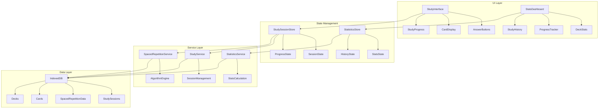

# Design Document

## Overview

이 설계 문서는 MyAnki 애플리케이션의 학습 세션 시스템과 학습 통계 및 진행률 추적 기능의 상세한 아키텍처와 구현 방안을 정의합니다. 기존에 구현된 기본적인 StudyInterface, StudyService, StudySessionStore를 확장하여 완전한 학습 시스템을 구축합니다.

이 시스템은 SM-2 간격 반복 알고리즘과 통합되어 사용자에게 최적화된 학습 경험을 제공하며, 상세한 통계 정보를 통해 학습 성과를 추적할 수 있게 합니다.

## Architecture

### 전체 아키텍처 다이어그램



### 레이어별 책임

1. **UI Layer**: 사용자 인터페이스 컴포넌트
2. **State Management**: Zustand를 사용한 전역 상태 관리
3. **Service Layer**: 비즈니스 로직과 데이터 처리
4. **Data Layer**: IndexedDB를 통한 데이터 영속성

## Components and Interfaces

### 1. 학습 세션 컴포넌트

#### StudyInterface (확장)
기존 StudyInterface를 확장하여 완전한 학습 세션 관리 기능을 제공합니다.

```typescript
interface StudyInterfaceProps {
  deckId: number;
  onComplete: (sessionSummary: SessionSummary) => void;
  onExit: () => void;
}

interface SessionSummary {
  cardsStudied: number;
  totalTime: number;
  averageQuality: number;
  correctAnswers: number;
  sessionDate: Date;
}
```

**주요 기능:**
- SM-2 알고리즘 기반 카드 순서 결정
- 키보드 단축키 지원 (스페이스바, 1-4 숫자키)
- 실시간 진행률 표시
- 세션 일시정지/재개 기능

#### AnswerButtons (신규)
4단계 답변 평가 버튼을 제공하는 컴포넌트입니다.

```typescript
interface AnswerButtonsProps {
  onAnswer: (quality: StudyQuality, responseTime: number) => void;
  disabled?: boolean;
}
```

#### CardDisplay (확장)
카드 표시 컴포넌트를 확장하여 더 나은 사용자 경험을 제공합니다.

```typescript
interface CardDisplayProps {
  card: Card;
  showAnswer: boolean;
  onShowAnswer: () => void;
  cardNumber: number;
  totalCards: number;
}
```

#### StudyProgress (신규)
학습 진행률을 시각적으로 표시하는 컴포넌트입니다.

```typescript
interface StudyProgressProps {
  current: number;
  total: number;
  percentage: number;
  timeElapsed: number;
  estimatedTimeRemaining: number;
}
```

### 2. 통계 컴포넌트

#### StatsDashboard (신규)
전체 학습 통계를 표시하는 대시보드 컴포넌트입니다.

```typescript
interface StatsDashboardProps {
  userId?: string; // 향후 다중 사용자 지원을 위한 준비
  timeRange: 'day' | 'week' | 'month' | 'year';
}
```

#### DeckStats (확장)
기존 DeckStats 컴포넌트를 확장하여 더 상세한 통계를 제공합니다.

```typescript
interface EnhancedDeckStatsProps {
  deckId: number;
  showDetailedBreakdown?: boolean;
  showTrendChart?: boolean;
}
```

#### StudyHistory (신규)
개별 카드의 학습 이력을 표시하는 컴포넌트입니다.

```typescript
interface StudyHistoryProps {
  cardId: number;
  limit?: number;
  showChart?: boolean;
}
```

#### GoalTracker (신규)
일일 학습 목표 추적 컴포넌트입니다.

```typescript
interface GoalTrackerProps {
  dailyGoal: number;
  currentProgress: number;
  goalType: 'cards' | 'time';
}
```

### 3. 상태 관리

#### StudySessionStore (확장)
기존 StudySessionStore를 확장하여 완전한 세션 관리 기능을 제공합니다.

```typescript
interface EnhancedStudySessionState {
  // 기존 상태
  currentCard: Card | null;
  isActive: boolean;
  loading: boolean;
  error: string | null;
  sessionStats: SessionStats;
  studyQueue: Card[];
  
  // 새로운 상태
  sessionStartTime: Date | null;
  isPaused: boolean;
  showAnswer: boolean;
  answerStartTime: Date | null;
  keyboardShortcutsEnabled: boolean;
  
  // 새로운 액션
  pauseSession: () => void;
  resumeSession: () => void;
  showCardAnswer: () => void;
  enableKeyboardShortcuts: (enabled: boolean) => void;
  getEstimatedTimeRemaining: () => number;
}
```

#### StatisticsStore (신규)
통계 데이터 관리를 위한 새로운 Zustand 스토어입니다.

```typescript
interface StatisticsState {
  // 덱별 통계
  deckStats: Map<number, DeckStatistics>;
  
  // 전체 통계
  globalStats: GlobalStatistics;
  
  // 학습 목표
  dailyGoals: DailyGoals;
  
  // 로딩 상태
  loading: boolean;
  error: string | null;
  
  // 액션
  loadDeckStats: (deckId: number) => Promise<void>;
  loadGlobalStats: () => Promise<void>;
  updateDailyGoal: (goalType: 'cards' | 'time', value: number) => Promise<void>;
  getDailyProgress: () => DailyProgress;
  getWeeklyTrend: () => WeeklyTrend;
}
```

### 4. 서비스 레이어

#### StudyService (확장)
기존 StudyService를 확장하여 세션 관리 기능을 추가합니다.

```typescript
interface EnhancedStudyService extends IStudyService {
  // 세션 관리
  startStudySession(deckId: number): Promise<StudySessionData>;
  pauseStudySession(sessionId: string): Promise<void>;
  resumeStudySession(sessionId: string): Promise<void>;
  endStudySession(sessionId: string): Promise<SessionSummary>;
  
  // 카드 큐 관리
  getNextCard(sessionId: string): Promise<Card | null>;
  updateSessionProgress(sessionId: string, progress: SessionProgress): Promise<void>;
  
  // 통계 계산
  calculateSessionStats(sessionId: string): Promise<SessionStats>;
  getEstimatedCompletionTime(sessionId: string): Promise<number>;
}
```

#### StatisticsService (신규)
통계 계산과 분석을 담당하는 새로운 서비스입니다.

```typescript
interface StatisticsService {
  // 덱 통계
  getDeckStatistics(deckId: number): Promise<DeckStatistics>;
  getDeckTrend(deckId: number, timeRange: TimeRange): Promise<TrendData>;
  
  // 카드 통계
  getCardStatistics(cardId: number): Promise<CardStatistics>;
  getCardLearningCurve(cardId: number): Promise<LearningCurveData>;
  
  // 전체 통계
  getGlobalStatistics(): Promise<GlobalStatistics>;
  getDailyProgress(): Promise<DailyProgress>;
  getWeeklyTrend(): Promise<WeeklyTrend>;
  getMonthlyReport(): Promise<MonthlyReport>;
  
  // 목표 관리
  setDailyGoal(goalType: 'cards' | 'time', value: number): Promise<void>;
  getDailyGoal(): Promise<DailyGoals>;
  checkGoalAchievement(): Promise<GoalAchievement>;
}
```

#### SessionManager (신규)
학습 세션의 생명주기를 관리하는 새로운 서비스입니다.

```typescript
interface SessionManager {
  createSession(deckId: number): Promise<string>; // sessionId 반환
  getSessionData(sessionId: string): Promise<StudySessionData>;
  updateSession(sessionId: string, updates: Partial<StudySessionData>): Promise<void>;
  deleteSession(sessionId: string): Promise<void>;
  
  // 세션 상태 관리
  pauseSession(sessionId: string): Promise<void>;
  resumeSession(sessionId: string): Promise<void>;
  isSessionActive(sessionId: string): Promise<boolean>;
  
  // 세션 통계
  getSessionProgress(sessionId: string): Promise<SessionProgress>;
  getSessionSummary(sessionId: string): Promise<SessionSummary>;
}
```

## Data Models

### 확장된 데이터 모델

#### StudySessionData
학습 세션의 전체 데이터를 관리하는 모델입니다.

```typescript
interface StudySessionData {
  id: string;
  deckId: number;
  userId?: string; // 향후 다중 사용자 지원
  startTime: Date;
  endTime?: Date;
  pausedTime: number; // 총 일시정지 시간
  status: 'active' | 'paused' | 'completed' | 'abandoned';
  
  // 진행률 정보
  totalCards: number;
  completedCards: number;
  currentCardIndex: number;
  
  // 통계 정보
  correctAnswers: number;
  totalResponseTime: number;
  qualityScores: StudyQuality[];
  
  // 설정
  keyboardShortcuts: boolean;
  autoAdvance: boolean;
}
```

#### DeckStatistics
덱별 상세 통계 정보입니다.

```typescript
interface DeckStatistics {
  deckId: number;
  totalCards: number;
  
  // 카드 상태별 분류
  newCards: number;
  learningCards: number;
  reviewCards: number;
  completedCards: number;
  
  // 학습 통계
  totalSessions: number;
  totalStudyTime: number;
  averageSessionTime: number;
  averageQuality: number;
  
  // 날짜별 통계
  lastStudiedAt?: Date;
  createdAt: Date;
  
  // 성과 지표
  retentionRate: number;
  difficultyRating: number;
  masteryLevel: number;
}
```

#### GlobalStatistics
전체 애플리케이션 통계입니다.

```typescript
interface GlobalStatistics {
  // 전체 현황
  totalDecks: number;
  totalCards: number;
  totalSessions: number;
  totalStudyTime: number;
  
  // 학습 성과
  overallAccuracy: number;
  averageSessionLength: number;
  studyStreak: number;
  longestStreak: number;
  
  // 시간별 분석
  dailyAverage: number;
  weeklyAverage: number;
  monthlyAverage: number;
  
  // 최근 활동
  lastStudyDate?: Date;
  recentActivity: ActivitySummary[];
}
```

#### DailyGoals
일일 학습 목표 관리입니다.

```typescript
interface DailyGoals {
  cardsGoal: number;
  timeGoal: number; // 분 단위
  streakGoal: number;
  
  // 현재 진행률
  cardsCompleted: number;
  timeCompleted: number;
  currentStreak: number;
  
  // 목표 달성 기록
  lastAchievedDate?: Date;
  totalAchievements: number;
}
```

## Error Handling

### 에러 타입 확장

기존 에러 시스템을 확장하여 학습 세션과 통계 관련 에러를 처리합니다.

```typescript
// ErrorCode 열거형에 추가
export enum ErrorCode {
  // ... 기존 코드들
  
  // 학습 세션 에러
  SESSION_NOT_FOUND = 'SESSION_NOT_FOUND',
  SESSION_ALREADY_ACTIVE = 'SESSION_ALREADY_ACTIVE',
  SESSION_PAUSED = 'SESSION_PAUSED',
  INVALID_SESSION_STATE = 'INVALID_SESSION_STATE',
  
  // 통계 에러
  STATS_CALCULATION_FAILED = 'STATS_CALCULATION_FAILED',
  INVALID_TIME_RANGE = 'INVALID_TIME_RANGE',
  GOAL_UPDATE_FAILED = 'GOAL_UPDATE_FAILED',
}

// ErrorFactory에 새로운 팩토리 메서드 추가
export class ErrorFactory {
  // ... 기존 메서드들
  
  static session = {
    notFound: (sessionId: string) => new MyAnkiError(
      ErrorCode.SESSION_NOT_FOUND,
      `Study session not found: ${sessionId}`,
      { sessionId }
    ),
    
    alreadyActive: (deckId: number) => new MyAnkiError(
      ErrorCode.SESSION_ALREADY_ACTIVE,
      `Study session already active for deck: ${deckId}`,
      { deckId }
    ),
    
    invalidState: (currentState: string, expectedState: string) => new MyAnkiError(
      ErrorCode.INVALID_SESSION_STATE,
      `Invalid session state: ${currentState}, expected: ${expectedState}`,
      { currentState, expectedState }
    )
  };
  
  static statistics = {
    calculationFailed: (operation: string, error: Error) => new MyAnkiError(
      ErrorCode.STATS_CALCULATION_FAILED,
      `Statistics calculation failed: ${operation}`,
      { operation, originalError: error.message }
    ),
    
    invalidTimeRange: (timeRange: string) => new MyAnkiError(
      ErrorCode.INVALID_TIME_RANGE,
      `Invalid time range: ${timeRange}`,
      { timeRange }
    )
  };
}
```

### 에러 처리 전략

1. **세션 에러**: 세션 상태 불일치, 중복 세션 등
2. **통계 에러**: 계산 실패, 데이터 부족 등
3. **사용자 친화적 메시지**: 기술적 에러를 사용자가 이해할 수 있는 메시지로 변환
4. **복구 메커니즘**: 자동 재시도, 대체 데이터 제공 등

## Testing Strategy

### 테스트 계층별 전략

#### 1. 단위 테스트
- **컴포넌트 테스트**: React Testing Library 사용
- **서비스 테스트**: Jest를 사용한 비즈니스 로직 테스트
- **스토어 테스트**: Zustand 상태 관리 테스트
- **유틸리티 테스트**: 순수 함수 및 계산 로직 테스트

#### 2. 통합 테스트
- **세션 워크플로우**: 전체 학습 세션 흐름 테스트
- **통계 계산**: 복잡한 통계 계산 로직 테스트
- **데이터베이스 통합**: IndexedDB와의 상호작용 테스트

#### 3. E2E 테스트
- **사용자 시나리오**: 실제 사용자 워크플로우 테스트
- **성능 테스트**: 대량 데이터 처리 성능 테스트
- **오프라인 테스트**: 네트워크 연결 없는 상황 테스트

### 테스트 데이터 관리

```typescript
// 테스트용 데이터 팩토리
export class TestDataFactory {
  static createStudySession(overrides?: Partial<StudySessionData>): StudySessionData {
    return {
      id: 'test-session-1',
      deckId: 1,
      startTime: new Date(),
      status: 'active',
      totalCards: 10,
      completedCards: 0,
      currentCardIndex: 0,
      correctAnswers: 0,
      totalResponseTime: 0,
      qualityScores: [],
      keyboardShortcuts: true,
      autoAdvance: false,
      pausedTime: 0,
      ...overrides
    };
  }
  
  static createDeckStatistics(overrides?: Partial<DeckStatistics>): DeckStatistics {
    return {
      deckId: 1,
      totalCards: 100,
      newCards: 20,
      learningCards: 30,
      reviewCards: 40,
      completedCards: 10,
      totalSessions: 15,
      totalStudyTime: 3600,
      averageSessionTime: 240,
      averageQuality: 3.2,
      createdAt: new Date(),
      retentionRate: 0.85,
      difficultyRating: 2.5,
      masteryLevel: 0.7,
      ...overrides
    };
  }
}
```

### Mock 전략

1. **IndexedDB Mock**: fake-indexeddb 사용
2. **서비스 Mock**: Jest mock 함수 사용
3. **시간 Mock**: Jest fake timers 사용
4. **랜덤 데이터**: 일관된 테스트를 위한 시드 기반 랜덤 데이터

## Performance Considerations

### 최적화 전략

#### 1. 데이터 로딩 최적화
- **지연 로딩**: 필요한 시점에만 데이터 로드
- **캐싱**: 자주 사용되는 통계 데이터 캐싱
- **배치 처리**: 여러 통계 계산을 한 번에 처리

#### 2. UI 성능 최적화
- **가상화**: 대량의 학습 기록 표시 시 가상 스크롤링
- **메모이제이션**: React.memo, useMemo 활용
- **디바운싱**: 실시간 통계 업데이트 시 디바운싱 적용

#### 3. 메모리 관리
- **세션 정리**: 완료된 세션 데이터 정리
- **이벤트 리스너 정리**: 컴포넌트 언마운트 시 정리
- **대용량 데이터 처리**: 스트리밍 방식으로 처리

### 성능 모니터링

```typescript
// 성능 측정 유틸리티
export class PerformanceMonitor {
  static measureSessionLoad(deckId: number): Promise<number> {
    const start = performance.now();
    return new Promise((resolve) => {
      // 세션 로딩 로직
      const end = performance.now();
      resolve(end - start);
    });
  }
  
  static measureStatsCalculation(operation: string): MethodDecorator {
    return function (target: any, propertyKey: string | symbol, descriptor: PropertyDescriptor) {
      const originalMethod = descriptor.value;
      descriptor.value = async function (...args: any[]) {
        const start = performance.now();
        const result = await originalMethod.apply(this, args);
        const end = performance.now();
        console.log(`${operation} took ${end - start} milliseconds`);
        return result;
      };
    };
  }
}
```

## Security Considerations

### 데이터 보안

1. **로컬 데이터 보호**: IndexedDB 데이터 암호화 (선택적)
2. **입력 검증**: 모든 사용자 입력에 대한 검증
3. **XSS 방지**: 사용자 생성 콘텐츠 sanitization

### 개인정보 보호

1. **데이터 최소화**: 필요한 데이터만 수집
2. **로컬 저장**: 모든 데이터를 로컬에 저장하여 프라이버시 보호
3. **데이터 삭제**: 사용자가 데이터를 완전히 삭제할 수 있는 기능

## Accessibility

### 접근성 고려사항

1. **키보드 네비게이션**: 모든 기능을 키보드로 접근 가능
2. **스크린 리더 지원**: ARIA 레이블 및 역할 정의
3. **색상 대비**: WCAG 2.1 AA 기준 준수
4. **포커스 관리**: 명확한 포커스 표시 및 순서

### 접근성 테스트

```typescript
// 접근성 테스트 유틸리티
export const accessibilityTests = {
  testKeyboardNavigation: (component: ReactWrapper) => {
    // 키보드 네비게이션 테스트
  },
  
  testAriaLabels: (component: ReactWrapper) => {
    // ARIA 레이블 테스트
  },
  
  testColorContrast: (element: HTMLElement) => {
    // 색상 대비 테스트
  }
};
```

이 설계 문서는 기존 구현을 기반으로 하여 완전한 학습 세션 시스템과 통계 추적 기능을 구축하기 위한 상세한 계획을 제공합니다. 각 컴포넌트와 서비스는 확장 가능하고 테스트 가능하도록 설계되었으며, 사용자 경험과 성능을 모두 고려한 구조로 되어 있습니다.